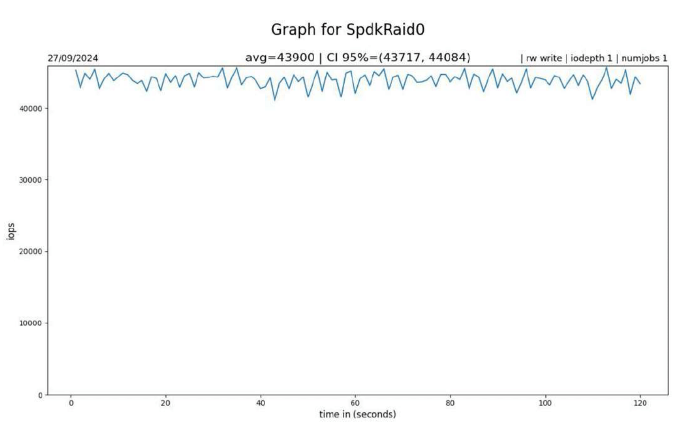

# Rlot

A utility for testing the performance of different RAID arrays of kernel space and user space

## Features

- Support for testing any of your mounted block devices
- Support for automatic launch of Mdadm RAID implementation _(kernel space)_
- Support for SPDK RAID implementations.

## TO-DO

1. Add more RAID array implementations such as ZFS and others

---

## Get started

### Installation

```
git clone https://github.com/PavlushaSource/Rlot.git
cd Rlot
```

### Prerequisites

**Source requirements**

```
rye sync
source .venv/bin/activate
```

**MDADM is a utility for testing the performance RAID from kernel space**

```
sudo apt update
sudo apt install mdadm
```

**SPDK RAID arrays for testing the performance of RAID implementations from user space**

1. Download and build [SPDK_FIO](https://github.com/spdk/spdk/tree/master/examples/bdev/fio_plugin)
2. Download [SPDK](https://github.com/spdk/spdk)
3. Build SPDK
   ```
   python3 -m venv .venv
   source .venv/bin/activate
   scripts/setup.sh
   scripts/pkgdep.sh
   ./configure --with-fio=/path/to/fio/repo --with-uring
   make
   ```

## Usage

All examples of configuration files are located in ./resources

### Configuration file

<table>
<tr>
<th> Bdev </th>
<th> Mdadm </th>
<th> SPDK </th>
</tr>
<tr>
<td>

```
[global]
ioengine=libaio
invalidate=1
ramp_time=30
size=128G
iodepth = 8
numjobs = 8
runtime = 120
bs = 4K
rw = write, read
dev = /dev/sdb
```

</td>
<td>

```
[global]
ioengine=libaio
iodepth = 1
numjobs = 4
rw = write, read, randread, randwrite

[raid]
dev = /dev/sdb, /dev/sdc, /dev/sdd
number_realization = 0
```

</td>

<td>

```
[global]
ioengine=spdk_bdev
ramp_time=5
rw = write
path_to_spdk_repo = /root/spdk

[spdk]
dev = /dev/sdb, /dev/sdc, /dev/sdd
number_realization = 0
```

</td>
</tr>
</table>

Some of them can be __omitted__, then the parameters will be taken from the file `./resources/default_<name>.ini`

#### Parameters that cannot be skipped

- `ioengine`
- `dev`
- `number_realization` _(for every RAID)_
- `path_to_spdk_repo` _(for SPDK)_

### Running

```
python3 main.py <path_to_conf_file.ini>
```

## Output

After the utility is finished, the out folder will be created in the project root, where iops, lat, clat, slat,
bandwidth graphs will be located.



## License

This project is licensed under the terms of the GPL-3.0 license. See
the [LICENSE](https://www.gnu.org/licenses/gpl-3.0.html) for more information.
